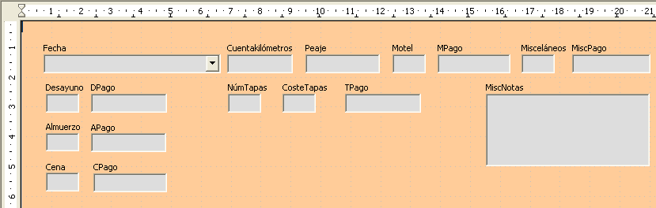

# Paso 3: mover los controles para agruparlos por categorías

Queremos que los controles aparezcan como en la imagen.

<li value="1">
Pulse en el primer control que quiera mover. Alrededor del control aparece un borde con ocho puntos de control verdes.
</li>
<li>
Mueva el cursor sobre la etiqueta o el campo del control. El cursor cambia a la forma de icono de arrastrar.
</li>
<li>
Arrastre el control y suéltelo donde quiera.
<table cellpadding="6" cellspacing="0" style="width: 419px; height: 53px;"><colgroup><col width="40*" /> <col width="216*" /> </colgroup>
<tbody>
<tr>
<td width="15%" bgcolor="#ffd320">
**Precaución**

</td>
<td width="85%" valign="top">
No pulse la tecla *Control* mientras mueve un campo, ya que sólo moverá el campo o la etiqueta, pero no ambos a la vez. Para mover ambos pulse una vez y arrástrelos al punto deseado.
</td>
</tr>
</tbody>
</table>
</li>
<li>
Utilice el mismo procedimiento para mover el resto de los controles a su sitio.
</li>

Mueva el cursor sobre la etiqueta o el campo del control. El cursor cambia a la forma de icono de arrastrar.

No pulse la tecla *Control* mientras mueve un campo, ya que sólo moverá el campo o la etiqueta, pero no ambos a la vez. Para mover ambos pulse una vez y arrástrelos al punto deseado.

