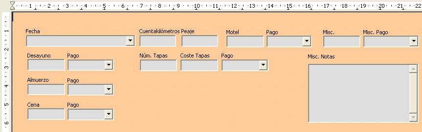

# Paso 6: sustituir campos con otros campos

Queremos sustituir el campo TipoPago por una Lista desplegable. De este modo podemos escoger el tipo de pago de la tabla Tipo Pago en vez de tener que escribirlo manualmente. En mi caso cada tipo de pago comienza por una letra diferente. Si yo escribo la primera letra del tipo de pago, el resto de la palabra aparece automáticamente. Entonces puedo cambiar al campo siguiente.

<li value="1">
Mantenga pulsada la tecla *Control* mientras hace clic sobre el campo Pago de Desayuno. Los puntos de control verde aparecen alrededor del campo pero no alrededor de la etiqueta.
</li>

<li>
Pulse con el botón derecho dentro de los puntos de control verdes y seleccione **Reemplazar por → Campo combinado.**
</li>
<li>
Pulse el icono Control en la barra de herramientas Controles de formulario para abrir la ventana Propiedades: Campo combinado.
</li>
<li>
En la pestaña General, desplácese hacia abajo hasta seleccionar Desplegable y cambie el valor *No* por *Sí**.*
</li>
<li>
Pulse sobre la pestaña Datos.
</li>

Pulse el icono Control en la barra de herramientas Controles de formulario para abrir la ventana Propiedades: Campo combinado.

<li>
*Tipo de contenido de lista* es una lista desplegable. Cámbielo a *Sql.*
</li>

<li>
En *Contenido de lista *escriba **exactamente** lo siguiente:
SELECT "Tipo" "Tipo" FROM "Tipo pago"
</li>

SELECT "Tipo" "Tipo" FROM "Tipo pago"

<td width="15%" bgcolor="#94bd5e">**Nota**</td><td width="85%" valign="top">Lo que acaba de escribir se llama un comando SQL. Las palabras *SELECT** *y *FROM* están escritas en mayúsculas porque son comandos. Cuando se usa el comando *SELECT* se requiere un nombre de campo entre comillas y el alias del campo, también entre comillas. En este caso el campo y su alias son iguales. El comando *FROM* requiere el nombre de la tabla que contiene el campo. No es necesario poner comillas en nombres de tabla de una sola palabra, pero hay que ponerlas si el nombre tiene más de una palabra.</td>

Lo que acaba de escribir se llama un comando SQL. Las palabras *SELECT** *y *FROM* están escritas en mayúsculas porque son comandos. Cuando se usa el comando *SELECT* se requiere un nombre de campo entre comillas y el alias del campo, también entre comillas. En este caso el campo y su alias son iguales. El comando *FROM* requiere el nombre de la tabla que contiene el campo. No es necesario poner comillas en nombres de tabla de una sola palabra, pero hay que ponerlas si el nombre tiene más de una palabra.

<li>
Repita estos pasos para los campos pago de Almuerzo, Cena, Motel, Tapas y Misc. El formulario debería quedar como se ve en la Figura 27, una vez colocados los controles. También se ve cómo queda el control Nota con los cambios que explicaremos en el paso siguiente.
</li>
<li>
Cierre la ventana Propiedades.
</li>

Cierre la ventana Propiedades.

