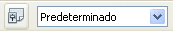

# Paso 9: añadir encabezados a los grupos

Este paso es más fácil de hacer si tiene visibles los marcadores de fin de párrafo. Seleccione **Ver → Caracteres no imprimibles** para mostrarlos.

<li value="1">
Asegúrese de que el cursor está en la esquina superior izquierda. Si no, pulse esa esquina para moverlo. 
</li>
<li>
Pulse la tecla *Enter* para mover el cursor hacia abajo hasta el espacio entre los campos Fecha y Desayuno.
</li>
<li>
En el campo combinado *Cambiar estilo* cambie *Predeterminado* por *Encabezado 2*.
</li>

Pulse la tecla *Enter* para mover el cursor hacia abajo hasta el espacio entre los campos Fecha y Desayuno.

<li>
Utilice la barra espaciadora para mover el cursor a donde desee que comience el encabezado.
</li>
<li>
Escriba el encabezado *Comidas*.
</li>
<li>
Use la barra espaciadora para mover el cursor al centro del área tapas.
</li>
<li>
Escriba el encabezado *Tapas*.
</li>
<li>
Utilice la tecla *Enter* para mover el cursor entre el control Cena y el subformulario.
</li>
<li>
Utilice la barra espaciadora para mover el cursor al centro del formulario.
</li>
<li>
Escriba *Datos de combustible*.
</li>

Escriba el encabezado *Comidas*.

Escriba el encabezado *Tapas*.

Utilice la barra espaciadora para mover el cursor al centro del formulario.
<td width="15%" bgcolor="#94bd5e">**Nota**</td><td width="85%" valign="top">Si sabe cómo usar estilos, puede abrir la ventana Estilo y formato pulsando la tecla *F11*. Al hacer clic con el botón secundario sobre Encabezado 2, se puede modificar el aspecto de los tres encabezados. </td>

Si sabe cómo usar estilos, puede abrir la ventana Estilo y formato pulsando la tecla *F11*. Al hacer clic con el botón secundario sobre Encabezado 2, se puede modificar el aspecto de los tres encabezados. 

