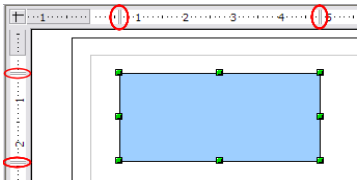
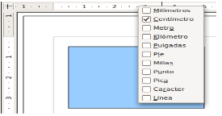

# Reglas

Se pueden ver las reglas (barras con números) en la parte superior y al lado izquierdo del área de trabajo. Muestran el tamaño de un objeto seleccionado en la página (vea las líneas dobles resaltadas de color gris en la siguiente imagen). Si no hay ningún objeto seleccionado, las reglas muestran la ubicación del puntero del ratón, lo que ayuda para posicionar correctamente los objetos. También puede usar las reglas para manejar las agarraderas y las líneas de guía, haciendo que la acción de posicionar los objetos se realice más fácilmente. Los márgenes de la página en el área de dibujo están representados sobre las reglas. Puede cambiar los márgenes directamente sobre las reglas arrastrándolos con el ratón.

Para modificar las unidades de medida de las reglas, pulse con el botón derecho en una de las reglas. Observe que las dos reglas pueden tener unidades de medida diferentes.

