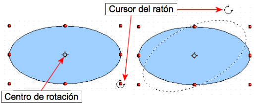

# Rotación

Rotar un objeto permite girar un objeto alrededor de un eje. Para llevar a cabo esta acción dinámicamente, use las manijas de color rojo, de una manera similar a cuando se cambia el tamaño de un objeto.
<td width="699" bgcolor="#94bd5e">**Nota**</td><td width="3646">La rotación funciona de forma distinta en objetos 3D, ya que se realiza en planos distintos y no en uno solo.</td>

Para rotar un objeto (o un grupo de objetos), arrastre con el ratón los puntos de control rojo de la esquina de la selección. El cursor cambia a forma de círculo abierto con puntas de flecha en cada extremo. Se verá el contorno del objeto como una línea de puntos y el ángulo de rotación se indica dinámicamente en la barra de estado.

Las rotaciones se hacen sobre un eje que se muestra como un símbolo pequeño. Puede mover ese eje de rotación con el ratón, tal como se ilustra en la imagen.

Si mantiene pulsada la tecla *Mayúsculas* durante la rotación, la acción se ejecutará aumentando cada vez 15°.

