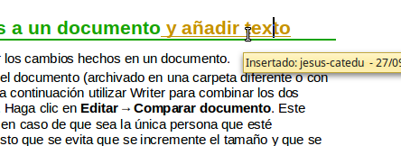

# Seguir los cambios hechos a un documento

<li>
Hacer los cambios en una copia del documento (archivado en una carpeta diferente o con otro nombre, o ambas premisas), a continuación utilizar Writer para combinar los dos archivos y mostrar las diferencias. Haga clic en **Editar ****→**** Comparar documento**. Este método resulta especialmente útil en caso de que sea la única persona que esté trabajando con el documento, puesto que se evita que se incremente el tamaño y que se añada complejidad al proceso, como ocurre con otros métodos.
</li>
<li>
Guardar versiones como si fuesen partes del documento original. No obstante, este método puede causar problemas con documentos muy extensos o complejos, especialmente si ha guardado una serie de versiones. Evite este método en la medida de lo posible.
</li>
<li>
Usar las marcas de cambio de Writer (habitualmente denominadas “lineas rojas” o “marcas de revisión”) para mostrar dónde se ha agregado o borrado material o en qué sección se ha cambiado el formato. Seleccione **Editar ****→**** Seguimiento de los cambios ****→**** Grabar cambios**.** **Posteriormente, usted o cualquier persona puede revisar y aceptar o rechazar cada uno de los cambios. Haga clic con el botón secundario en un cambio concreto y elija en el menú desplegable **Aceptar cambio **o **Rechazar **cambio*.*
</li>

Guardar versiones como si fuesen partes del documento original. No obstante, este método puede causar problemas con documentos muy extensos o complejos, especialmente si ha guardado una serie de versiones. Evite este método en la medida de lo posible.
<td width="16%" bgcolor="#83caff">**Sugerencia**</td><td width="84%">No se graban todos los cambios. Por ejemplo, el cambio de un tabulador para alinear hacia la derecha en lugar de a la izquierda, los cambios en fórmulas (ecuaciones) o los gráficos enlazados no se registran.</td>

No se graban todos los cambios. Por ejemplo, el cambio de un tabulador para alinear hacia la derecha en lugar de a la izquierda, los cambios en fórmulas (ecuaciones) o los gráficos enlazados no se registran.

