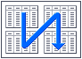

# Seleccionar el orden de páginas, detalles y escala

Para seleccionar el orden de páginas, detalles, y escala para imprimir:

1. Seleccione **Formato **→** Página** en el menú principal.

2. Seleccione la pestaña **Hoja**

3. Haga sus selecciones, y pulse **Aceptar**.

**Orden de página**

Se puede establecer el orden en que se imprimen las páginas. Esto es especialmente útil en un documento largo; por ejemplo, controlar el orden de impresión puede ahorrar tiempo si desea compaginar el documento de cierta manera. Las opciones disponibles se muestran a continuación:

De arriba hacia abajo, después hacia la derecha

De izquierda a derecha y hacia abajo 

**Imprimir**

Se puede especificar qué detalles imprimir. Los detalles incluyen:

<li>
Títulos de fila y columna
</li>
<li>
Cuadrícula — imprime los bordes de celdas como una cuadrícula.
</li>
<li>
Comentario—imprime los comentarios definidos en su hoja de cálculo en una hoja separada, junto a la referencia a la celda correspondiente
</li>
<li>
Objetos e imágenes
</li>
<li>
Gráficos
</li>
<li>
Objetos de dibujo
</li>
<li>
Fórmulas—imprime las fórmulas contenidas en las celdas, en lugar de los resultados
</li>
<li>
Valores cero—imprime las celdas con valor cero
</li>

**Nota:** Recuerde que los detalles de las opciones de impresión son una parte de las propiedades de página, son además una parte de las propiedades de estilo. Por ello, se pueden establecer diferentes estilos de página para cambiar rápidamente las opciones de impresión de las hojas en una hoja de cálculo.

**Escala**

Utilice las características de escala para controlar el número de páginas que se imprimirán. Esto puede ser útil si se necesita imprimir un gran número de datos de manera más compacta o, si el lector tiene problemas de visión, se puede agrandar el texto al imprimirse.

* Reducir/Ampliar impresión—escala los datos en la impresión haciéndolos más grandes o pequeños. Por ejemplo, si una hoja se puede imprimir normalmente en cuatro páginas (dos a lo ancho y dos a lo largo), con una escala de 50% se puede imprimir en una página (ambas reducidas a la mitad en ancho y largo).
* Ajustar intervalos de impresión en números de páginas—define exactamente cuántas paginas de impresión se pueden ocupar. Esta opción sólo puede reducir una impresión, no la agrandará. Para agrandar una impresión, se debe usar la opción ampliar/reducir.
* Ajustar intervalos de impresión a lo alto/ancho—define el alto y ancho de la impresión, en páginas.
