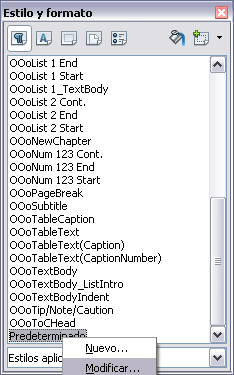
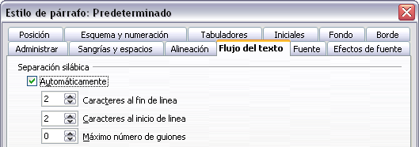
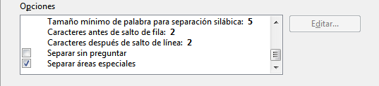

# Separación silábica

Dispone de varias opciones respecto a la división de palabras: permitir que Writer lo haga de manera automática (a través de los diccionarios de separación silábica), insertar guiones manualmente donde sea necesario o no usar guiones para separar las sílabas.

## Separación silábica automática

<li>
Presione *F11* para abrir la ventana de Estilo y formato.
</li>
<li>
En la Pestaña del Estilo de párrafo, haga clic con el botón secundario en **Predeterminado **que aparece en la lista y seleccione **Modificar**.
</li>
<li>
En el diálogo de Estilo de párrafo, elija la página de **Flujo del Texto**.
</li>
<li>
Debajo de **División de palabras**, seleccione o desmarque la opción de **Automáticamente**. Haga clic en **Aceptar** para guardar.
</li>

En la Pestaña del Estilo de párrafo, haga clic con el botón secundario en **Predeterminado **que aparece en la lista y seleccione **Modificar**.

Debajo de **División de palabras**, seleccione o desmarque la opción de **Automáticamente**. Haga clic en **Aceptar** para guardar.
<td width="16%" bgcolor="#94bd5e">**Nota**</td><td width="84%">La activación de la separación silábica para el estilo de párrafo predeterminado afecta a todos los otros estilos de párrafos que se basan en él. Puede cambiar individualmente otros estilos de manera que la separación silábica no esté activa, por ejemplo, en el caso de que no desee que los encabezados admitan separación silábica. Cualquier estilo que no se base en el *Predeterminado* no se verá afectado.</td>

La activación de la separación silábica para el estilo de párrafo predeterminado afecta a todos los otros estilos de párrafos que se basan en él. Puede cambiar individualmente otros estilos de manera que la separación silábica no esté activa, por ejemplo, en el caso de que no desee que los encabezados admitan separación silábica. Cualquier estilo que no se base en el *Predeterminado* no se verá afectado.

Asimismo, puede configurar las opciones de la separación silábica a través de **Herramientas ****→**** Opciones ****→**** Configuración de idioma ****→**** Asistencia a la escritura**. En Opciones, en la parte inferior del diálogo, desplace la barra hacia abajo hasta encontrar las configuraciones de separación silábica.

Si desea cambiar el tamaño mínimo de la palabra para aplicar la separación silábica, el número mínimo de caracteres antes o después de un salto de fila, selecciones el elemento y a continuación haga clic en el botón **Editar **de la sección Opciones.

Las opciones de configuración de división silábica en el diálogo de **Asistencia a la escritura** son efectivas sólo cuando la división silábica está activada a través de los estilos de párrafo.

## Separación silábica manual

Si desea separar las sílabas de forma manual, *no use *un guion normal porque quedará visible aun cuando la palabra ya no está situada al final de una línea, al haberse añadido o borrado texto, o modificado los márgenes o el tamaño de la fuente. En su lugar, use un *guion condicionado*, que es visible solo cuando es necesario.

Para insertar un guión condicionado en medio de una palabra, haga clic donde desee que aparezca el guion y presione *Control+guion *(signo menos)* *. La palabra quedará dividida por un guion cuando aparezca al final de la línea, inclusive si la separación silábica automática esta desactivada para este párrafo.

 

