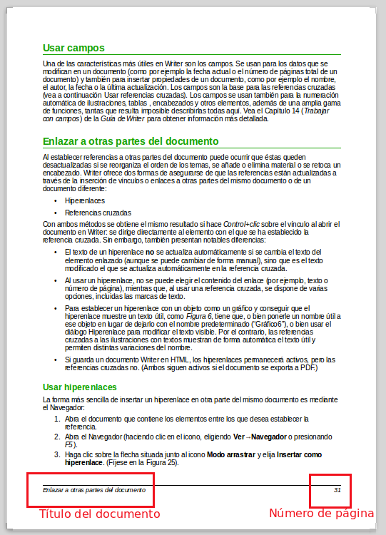

# Usar campos

Para insertar **campos **en su documento, vaya a **Insertar - Campos**. Será muy útil para colocar en el pie de página el número de la misma o el título del documento como puedes ver en la imagen.

<iframe width="960" height="569" src="https://docs.google.com/presentation/d/1yzjm2oxhl_W4cBJ06SeNhwzXWTwfW_B02epYrRCSui0/embed?start=false&amp;loop=false&amp;delayms=3000"></iframe> 

