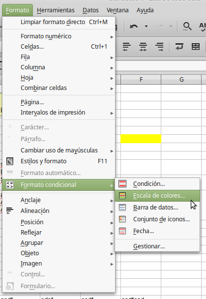

# Usar el formato condicional

Puede configurar formatos de celda para cambiar dependiendo de las condiciones que especifique. Por ejemplo, en una tabla con números, puede mostrar todos los valores por encima de la media en verde y los que están por debajo de la media en rojo. El formato condicional depende de los estilos, y la característica Cálculo automático tiene que estar activada (**Herramientas **→** Contenido de las celdas **→** Cálculo automático**).

Para aplicar este formato a un grupo de celdas, selecciónelas y vaya a **Formato - Formato Condicional**.

Ya sólo tendrá que establecer las condiciones que gobernarán el formato de estas celdas.

