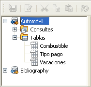
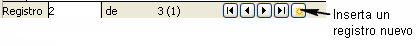
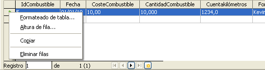

# Usar fuentes de datos en LibreOffice

Tras registrar una fuente de datos, bien sea una hoja de cálculo, un documento de texto, una base de datos externa u otra fuente de datos admitida, puede usarla en otro componente de LibreOffice, incluyendo Writer y Calc.

### Ver fuentes de datos

Abra un documento en Writer o Calc. Para ver las fuentes de datos disponibles, pulse *F4* o seleccione **Ver → Fuente de datos** en el menú. Esto nos mostrará una lista de bases de datos registradas, incluyendo Bibliography y cualquier otra base de datos registrada, como la base de datos Automovil creada anteriormente en este capítulo.

Para ver las bases de datos, pulse en el signo **+** o la flecha que hay a la izquierda de los nombres de la base de datos. Esto nos mostrará Tablas y Consultas. Pulse el signo **+** o flecha que hay junto a Tablas para ver las tablas existentes. Ahora pulse en una tabla para ver sus registros.

### Editar fuentes de datos

Algunas fuentes de datos pueden ser editadas en el diálogo Ver fuentes de datos. Las hojas de cálculo no se pueden editar. Un registro se puede modificar, añadir o eliminar.

Bajo los registros hay cinco botones pequeños. Los cuatro primeros se mueven hacia adelante o hacia atrás por los registros, o al principio y final de los mismos. El quinto botón, con una pequeña estrella, inserta un registro nuevo.

Para eliminar un registro, pulse con el botón derecho en la zona gris que hay a la izquierda de una fila para resaltarla y seleccione **Eliminar filas** para eliminar la fila seleccionada. 

### Lanzar Base para trabajar en fuentes de datos

Puede lanzar LibreOffice Base en cualquier momento desde el panel Fuente de datos. Simplemente haga clic con el botón secundario en una base de datos o en el icono de la tabla o consulta, y seleccione **Editar archivo de la base de datos**. Una vez esté en Base, puede modificar, añadir o eliminar tablas, consultas, formularios o informes.

### Usar fuentes de datos en Writer y Calc

Se pueden colocar los datos de las tablas en la ventana Fuentes de datos en documentos de Writer y Calc. En Writer se pueden insertar valores de campos individuales o se puede crear una tabla completa en el documento de Writer. Un modo común de usar una fuente de datos es combinar correspondencia.

