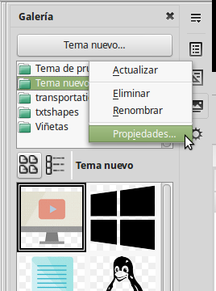
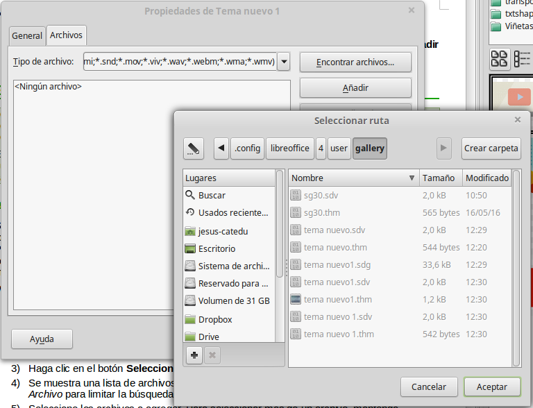

# Usar la Galería de LibreOffice

Los gráficos en la Galería están agrupados por **temas**, como Flechas, Ordenadores o Diagramas. Se pueden crear otros grupos o temas.

**Para insertar un objeto hay dos métodos**:

1. Clicar sobre el objeto deseado y **arrastrar**.
<li lang="es-ES">Clicar con el **botón derecho** sobre el icono y después:<ol>
1. Insertar, para colocar el objeto en la posición actual del cursor.
1. Insertar como fondo... (de página o de párrafo). El objeto se replica en mosaico detrás del texto para generar un fondo.

## Gestionar la Galería

Los temas por defecto están bloqueados. No se pueden añadir ni borrar objetos de estos temas. Los temas bloqueados se reconocen fácilmente porque, al hacerles clic derecho, la única opción del menú contextual es **Propiedades**.

En una instalación predefinida, tan sólo el tema “**Mis temas**” se puede personalizar, aunque **pueden añadirse nuevos temas**. Para ello, clique clique en **Tema nuevo...** Aparecerá una ventana en la que deberá introducir el nombre que quiere darle al tema. Después, en la misma ventana, seleccione la pestaña archivos y navegue hasta la carpeta donde tenga guradados los objetos deseados. Una vez seleccionada la carpeta, seleccione los archivos disponibles y clique en **Añadir. **Así de fácil. Ya tendrá sus objetos recurrentes siempre a mano.

Podrá ir añadiendo más objetos a su tema guardándolos en la misma carpeta que seleccionó. En LibreOffice deberá clicar con el **botón derecho sobre el tema - Actualizar**.

