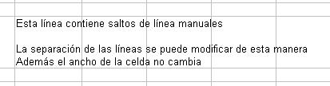

# Usar saltos de línea manual

Para insertar un salto de línea manual mientras escribe en una celda, pulse *Control+Enter*. Este método no funciona con el cursor en la línea de entrada. Cuando edite texto, primero haga doble clic en la celda, y luego uno simple en la posición donde quiere insertar el salto de línea. Ahora puede pulsar Ctrl+Enter.

Cuando se introduce un salto de línea manual, el ancho de la celda no cambia, sólo cambia la altura. La imagen muestra el resultado de usar dos saltos de línea manuales después de la primera línea de texto.

