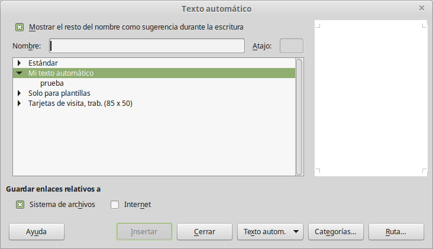

# Utilizar autotexto

Para asignar un atajo del teclado a un fragmento de texto:

<li>
Escriba el texto en el documento.
</li>
<li>
Seleccione el texto de manera que quede resaltado.
</li>
<li>
Seleccione **Editar ****→**** Autotexto** (o presione *Control**+F3*).
</li>
<li>
Escriba un nombre para el atajo del teclado. Writer sugerirá un atajo de una sola letra, pero se puede cambiar.
</li>
<li>
Haga clic en el botón de **Texto auto. **situado en la parte derecha y seleccione **Nuevo (solo texto)** desde el menú.
</li>
<li>
Haga clic en **Cerrar **para regresar a su documento.
</li>

Seleccione el texto de manera que quede resaltado.

Escriba un nombre para el atajo del teclado. Writer sugerirá un atajo de una sola letra, pero se puede cambiar.

Haga clic en **Cerrar **para regresar a su documento.
<td width="16%" bgcolor="#83caff">**Sugerencia**</td><td width="84%">Si la única opción que aparece debajo del botón de Autotexto es la de Importar, se debe a que no ha dado un nombre al atajo del teclado del Autotexto o no ha seleccionado ningún texto en el documento.</td>

Si la única opción que aparece debajo del botón de Autotexto es la de Importar, se debe a que no ha dado un nombre al atajo del teclado del Autotexto o no ha seleccionado ningún texto en el documento.

Autotexto es especialmente eficaz cuando se le asignan campos. Hablaremos de esto más adelante.

